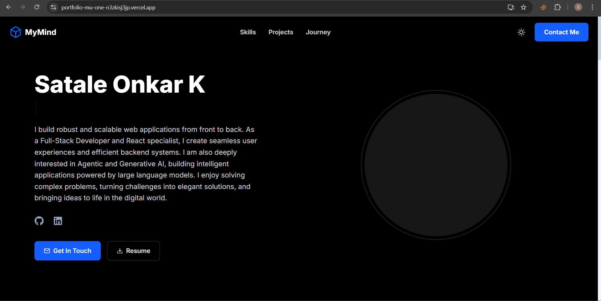
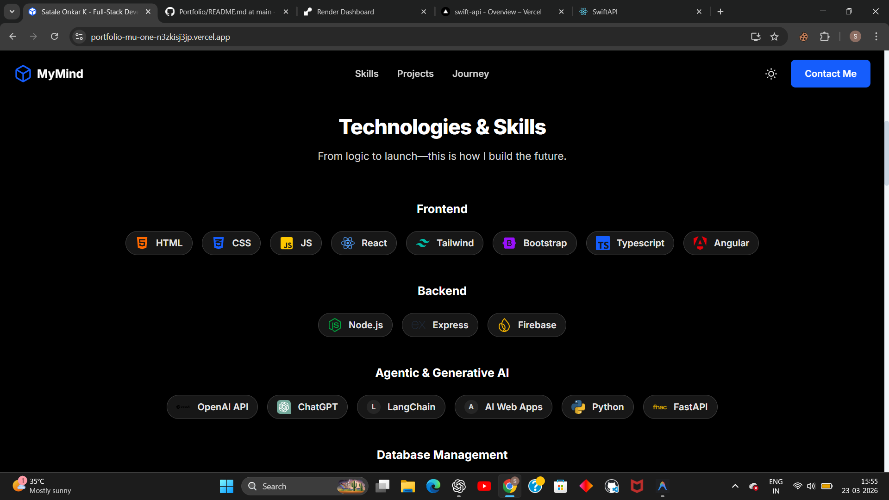
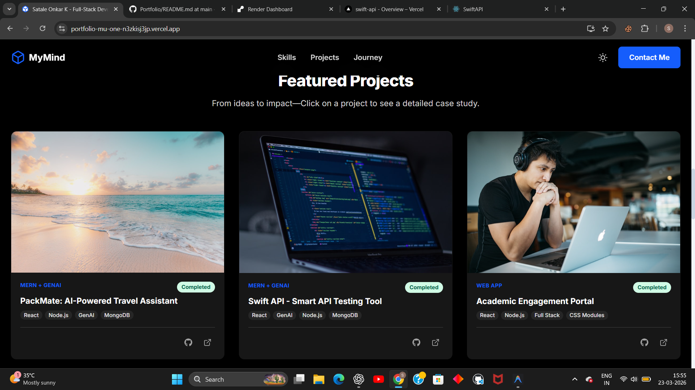
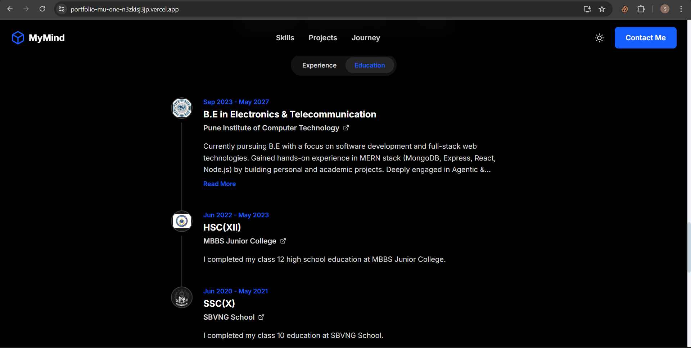
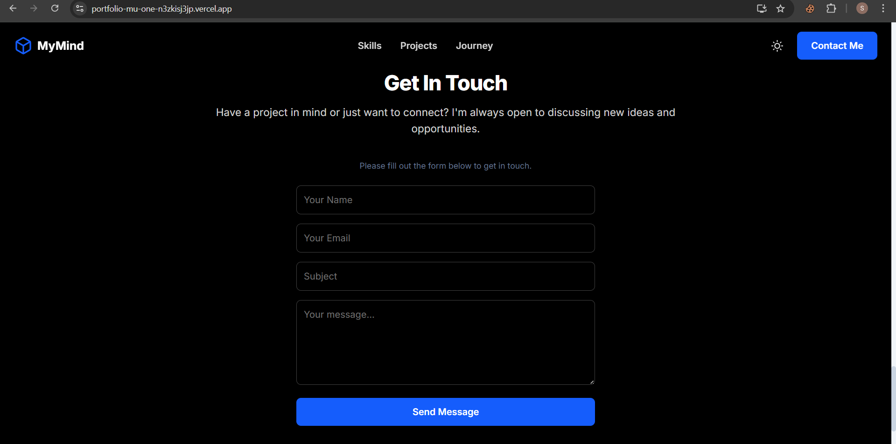

# 🚀 Portfolio Website

A modern, portfolio web application built using React, Tailwidn CSS.
This project showcases my skills, projects, and experience with a dynamic and interactive UI.

---

## 🌐 Live Demo

👉 https://portfolio-mu-one-n3zkisj3jp.vercel.app/

---

## 📌 Features

* ✨ Fully responsive modern UI
* 📬 Contact form with Web3forms API integration
* 📂 Dynamic project showcase
* 🧠 Skills & journey timeline sections
* 🌙 Dark mode support
* ⚡ Fast performance with Vite
* 🔔 Toast notifications system

---

## 🛠️ Tech Stack

### Frontend

* React (with TypeScript)
* Vite
* Tailwind CSS

---

## 📁 Project Structure

```
portfolio_light/
├── src/                  # Frontend (React)
│   ├── components/
│   ├── pages/
│   ├── layouts/
│   ├── services/
│   └── context/
│
├── public/
├── package.json
└── vite.config.ts
```

---

## ⚙️ Installation & Setup

### 1️⃣ Clone the repository

```bash
git clone https://github.com/Onkar-Satale/Portfolio.git
cd Portfolio
```

---

### 2️⃣ Install dependencies

#### Frontend

```bash
npm install
```

---

### 3️⃣ Run the project

#### Start Frontend

```bash
npm start 
```

---

## 📸 Screenshots

Here are key pages from my portfolio, highlighting UI, features, and light/dark mode.

---

### 🌟 Landing Page
  
*Main landing page showcasing navigation and responsive design. Light/Dark mode toggle available.*

---

### 📝 About / Skills
  
*Skills section highlighting my technical expertise and professional summary.*

---

### 💻 Projects
  
*Projects showcase, including PackMate: AI-powered travel assistant.*

---

### 🎓 Education
  
*Education and academic timeline, highlighting key milestones.*

---

### 📬 Contact
  
*Contact section with interactive form and social links.*

---

## 🚀 Future Improvements

* 🤖 AI chatbot integration
* 📊 Visitor analytics dashboard
* 🌍 Multi-language support
* 📱 Progressive Web App (PWA)

---

## 🤝 Contributing

Contributions are welcome! Feel free to fork this repo and submit a pull request.

---

## 📄 License

This project is licensed under the MIT License.

---

## 👤 Author

**Onkar Satale**

* GitHub: https://github.com/Onkar-Satale

---

## ⭐ Show Your Support

If you like this project, give it a ⭐ on GitHub!
